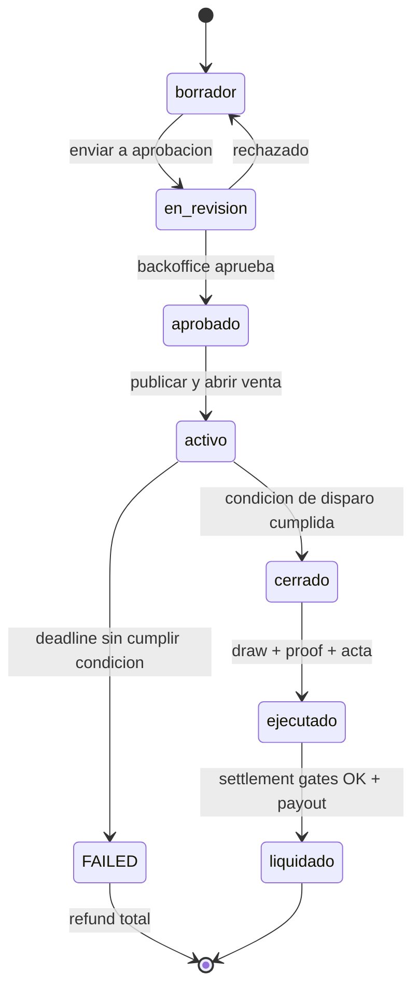

# Flujo end-to-end del sistema

Esquema maestro del **flujo de procesos** de Libox: el camino completo de una rifa desde que un organizador se registra hasta que el dinero se liquida y el sorteo queda auditado. Es la "vista de pájaro" que conecta los [8 dominios del sistema](../plans/libox-plan.md#3-dominios-del-sistema-bounded-contexts) y respeta las decisiones cerradas (custodia [Z.1](../decisions/Z1-custodia-del-dinero.md), PSP [Z.2](../decisions/Z2-eleccion-psp.md), organizador [Z.3](../decisions/Z3-tipo-de-organizador.md), motor de sorteo [Z.4](../decisions/Z4-tipos-de-sorteo.md)).

Los términos (`pool_hash`, `external_entropy`, `settlement gates`, cuentas del ledger, etc.) están definidos en el [glosario](../glosario.md). Este documento es la base para los wireframes de los 5 flujos críticos pendientes.

---

## 1. Diagrama maestro

```mermaid
flowchart TD
    subgraph ID["1 · Identidad y Onboarding"]
        A1["Organizador se registra<br/>natural o juridica con RUC"] --> A2{"KYC: RUC activo<br/>en padron SUNAT?"}
        A2 -- No --> A3["Rechazo / subsanacion"]
        A2 -- Si --> A4["Organizador aprobado<br/>merchant of record"]
    end

    subgraph CAT["2 · Catalogo de sorteos"]
        A4 --> B1["Crea sorteo: premio, precio,<br/>total boletos, draw_config,<br/>autorizacion municipal"]
        B1 --> B2["borrador -> en revision"]
        B2 --> B3{"Backoffice<br/>aprueba?"}
        B3 -- No --> B4["Devuelto a borrador"]
        B3 -- Si --> B5["activo: publicado,<br/>venta abierta"]
    end

    subgraph SALE["3 y 4 · Venta de boletos + Pagos"]
        B5 --> C1["Participante elige boletos<br/>y va a checkout"]
        C1 --> C2["Pago Mercado Pago<br/>split en la fuente<br/>con Idempotency-Key"]
        C2 --> C3{"Webhook firmado:<br/>pago aprobado?"}
        C3 -- No --> C4["Boletos liberados,<br/>orden cancelada"]
        C3 -- Si --> C5["Asigna numero de boleto<br/>idempotente, sin duplicar"]
        C5 --> C6["Comprobante PSE<br/>lo emite el organizador"]
        C6 --> C7["Ledger doble entrada:<br/>Cash Clearing / Purchase<br/>Liability / Platform Revenue"]
    end

    subgraph DRAW["5 · Ejecucion del sorteo"]
        C7 --> D1{"Condicion de disparo:<br/>umbral y/o fecha?"}
        D1 -- "No se cumple<br/>al deadline" --> D2["Estado: FAILED"]
        D2 --> D3["Refund total via PSP<br/>+ reverso en ledger"]
        D1 -- "Se cumple" --> D4["Cierre de venta:<br/>congela boletos"]
        D4 --> D5["canonical_pool -> pool_hash<br/>commit publicado"]
        D5 --> D6["external_entropy<br/>drand / beacon NIST"]
        D6 --> D7["seed_material -> random_value<br/>-> winner_index"]
        D7 --> D8["Ganador + draw proof<br/>+ acta firmada PDF"]
        D8 --> D9["Estado: ejecutado"]
    end

    subgraph SET["6 · Liquidacion de premios"]
        D9 --> E1["Notifica al ganador"]
        E1 --> E2{"Premio supera umbral<br/>IR 2da categoria?"}
        E2 -- Si --> E3["KYC ganador<br/>+ retencion IR"]
        E2 -- No --> E4["Sin retencion"]
        E3 --> E5{"Settlement gates: draw OK,<br/>entrega OK, sin disputa,<br/>ledger cuadra, PSP conciliado"}
        E4 --> E5
        E5 -- "Todos OK" --> E6["Payout al organizador<br/>+ comision reconocida<br/>Estado: liquidado"]
    end

    subgraph DEL["Entrega del premio · MVP-2"]
        E6 -.-> F1["Organizador sube evidencia<br/>-> usuario confirma"]
        F1 -.-> F2{"Disputa?"}
        F2 -. Si .-> F3["Settlement Freeze<br/>Admin resuelve"]
    end

    AX["7 · Auditoria transversal<br/>audit_events append-only<br/>prev_hash -> hash, trace_id<br/>pagina publica de verificacion"]

    A2 -.-> AX
    B3 -.-> AX
    C3 -.-> AX
    D3 -.-> AX
    D8 -.-> AX
    E6 -.-> AX
```

---

## 2. Máquina de estados del sorteo

El sorteo es la entidad central; su ciclo de vida gobierna qué acciones son válidas en cada momento (state machine, ver glosario). La rama `FAILED` es el acople invisible con pagos: si no se cumple la condición de disparo al deadline, **se reembolsa a todos** (ver [Z.4](../decisions/Z4-tipos-de-sorteo.md)).

---

## 3. Lectura por fases

**A · Onboarding (dominio 1).** Solo organizadores con **RUC activo** (natural o jurídica, [Z.3](../decisions/Z3-tipo-de-organizador.md)). El KYC valida el RUC contra el padrón SUNAT; el organizador queda como *merchant of record* (emite el comprobante, no Libox).

**B · Creación y aprobación (dominio 2).** El organizador define premio, precio, total de boletos, el `draw_config` versionado (condición de disparo + 1 ganador en MVP-1) y adjunta la autorización municipal. Pasa por **aprobación manual de backoffice** antes de publicarse.

**C · Compra (dominios 3 y 4).** El punto más crítico por concurrencia y dinero. Pago con **Mercado Pago, split en la fuente** ([Z.2](../decisions/Z2-eleccion-psp.md)): el dinero del participante nunca pasa por Libox (Modelo C, [Z.1](../decisions/Z1-custodia-del-dinero.md)). `Idempotency-Key` + webhook firmado evitan dobles cobros y dobles asignaciones. Recién con el pago consolidado se asigna número de boleto y se emite el comprobante vía PSE. El ledger doble entrada corre desde el día 1 aunque la custodia sea conceptual.

**D · Ejecución (dominio 5).** Al cumplirse la condición (umbral y/o fecha) se cierra la venta y se congela el `canonical_pool`. La cadena de fairness `pool_hash → external_entropy → seed_material → random_value → winner_index` produce un ganador **reproducible por cualquier tercero** (draw proof + acta firmada). Si la condición no se cumple al deadline → `FAILED` → refund total.

**E · Liquidación (dominio 6).** Notificación al ganador, KYC y retención de **IR de 2da categoría** si el premio supera el umbral legal. El payout al organizador y el reconocimiento de la comisión solo se liberan cuando pasan todos los **settlement gates** (draw ejecutado, entrega resuelta, sin disputa, ledger cuadrado, PSP conciliado). Bajo Modelo C los gates son **conceptuales** (registran estado, no congelan dinero real).

**F · Entrega — MVP-2 (línea punteada).** Evidencia del organizador → confirmación del usuario, con disputa que dispara `Settlement Freeze` hasta que Admin resuelve. Fuera de MVP-1.

**G · Auditoría (dominio 7, transversal).** Cada acción sensible (aprobaciones, pago, refund, draw, payout) escribe un `audit_event` **append-only** con `prev_hash → hash` y `trace_id`, y alimenta la **página pública de verificación** por sorteo.

---

## 4. Pendiente

- Wireframes de los 5 flujos críticos (registro de organizador, creación de sorteo, compra, ejecución, vista pública de auditoría).
- Diagramas de detalle por flujo (secuencia de compra con webhooks; secuencia de ejecución con commit-reveal) — pendientes según prioridad.
- Validar con el abogado la evidencia digital del sorteo y el umbral de IR ([compliance-peru.md](../compliance-peru.md)).
